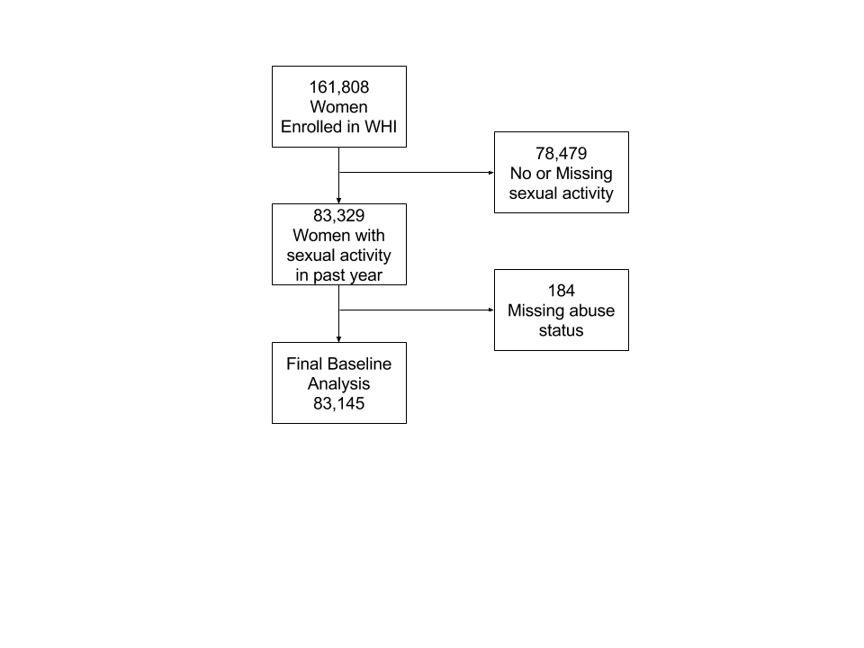

<!-- README.md is generated from README.Rmd. Please edit that file -->

```{r, echo = FALSE}
knitr::opts_chunk$set(
  collapse = TRUE,
  comment = "#>",
  fig.path = "README-"
)
```

## Introduction

This is the research repository for MS3226: Partner abuse and sexual satisfaction among postmenopausal women. For more information scroll down through this page, or click on a link in the table of contents below. More information about the Women's Health Initiative (WHI) is available [here](https://www.whi.org/SitePages/WHI%20Home.aspx).

## Table of Contents

1. [Analysis dashboard](https://cdn.rawgit.com/brad-cannell/whi_sexual_function/49dc3e1f/R%20notebooks/dashboard.html). Click on the analysis dashboard link for an overview of all study results in a dashboard format.

2. [Study objectives](#objectives)

3. [Links to data cleaning and analysis codes](#codes). You can find the codes used to clean our data and perform statistical analysis in the folders above. Additionally, you can use the links provided in this section.

4. [Manuscript information](). This link is not yet active.

<H2 id = "objectives">Study objectives</H2>

Building on prior work related to abuse exposure and functional outcomes in postmenopausal women (1,3), the primary aim of the proposed work is to investigate the cross-sectional relationship between self-reported recent (past-year) physical and verbal abuse and self-reported sexual satisfaction, among postmenopausal women enrolled in the WHI. Women in the OS and/or CT components (aged 50-79 years at baseline) who responded “yes” to item 129 on Form 37 (“Did you have any sexual activity with a partner in the last year”) at baseline will be included in analyses. Our hypotheses are as follows: 

1. Rates of global sexual dissatisfaction at baseline will be higher among women who report past-year abuse at baseline compared to women who did not; and 

2. Rates of sexual frequency dissatisfaction at baseline will be higher among women who report past-year abuse at baseline than among women who do not report baseline abuse. Descriptive analyses will characterize the directionality of sexual frequency satisfaction (i.e., desiring more/less frequency) by past-year abuse status, among sexually dissatisfied women at baseline.

A subsidiary aim is to conduct cross-sectional descriptive analyses to characterize sexual satisfaction (Global/Frequency) among women according to their recent abuse history and presence/absence of depression.




<H2 id = "codes">Data cleaning and analysis codes</H2>

For more information about our analysis process and results, please click in the individual code file of interest below:

[Code used to clean the demographics and study membership form](/SAS/dem_ctos_inv.sas)

[Code used to clean form 2](/SAS/f2_ctos_inv.sas)

[Code used to clean form 20](/SAS/f20_ctos_inv.sas)

[Code used to clean form 30](/SAS/f30_ctos_inv.sas)

[Code used to clean form 31](/SAS/f31_ctos_inv.sas)

[Code used to clean form 34](/SAS/f34_ctos_inv.sas)

[Code used to clean form 35](/SAS/f35_ct_inv.sas)

[Code used to clean form 37](/SAS/f37_ctos_inv.sas)

[Code used to clean form 38](/SAS/f38_ctos_fu_inv.sas)

[Code used to clean form 44](/SAS/f44_ctos_inv.sas)

[Code used to clean form 60](/SAS/f60_ctos_inv.sas)

[Code used to clean form 80](/SAS/f80_ctos_inv.sas)

[Code used to clean form 81](/SAS/f81_ht_inv.sas)

[Code used to merge individual forms](/SAS/merge_forms.sas)

&nbsp;

### Codes for data preprocessing in R

-----

1. [Code used for importing data into R](/R notebooks/preprocess_01_read_sas.md)

2. [Code used for preliminary variable management](/R notebooks/preprocess_02_preliminary_variable_management.md)

3. [Code used to clean and manage abuse variables](/R notebooks/preprocess_03_abuse.md)

4. [Code used to clean and manage sexual function variables](/R notebooks/preprocess_04_sexual_function.md)

5. [Code used to clean and manage covariates of interest](/R notebooks/preprocess_05_covariates.md)

6. [Code used to subset baseline data](/R notebooks/preprocess_06_subset_baseline.md)

7. [Code used for multiple imputation](/R notebooks/preprocess_07_multiple_imputation.md)


### Codebooks

[Merged WHI dataset](https://rawgit.com/brad-cannell/whi_sexual_function/master/SAS_reports/merged_codebook.html)
